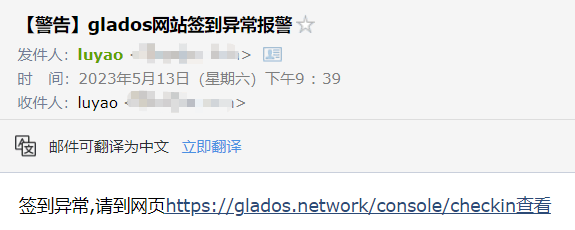

# 简介
- **glados_auto_sign_in 是一个 Python 实现的自动签到脚本**，只需要在 `config.yaml` 文件中配置几个关键的参数即可快速上手。
- 支持签到异常时发邮件报警（简单配置即可使用）

**注**：
- [glados](https://glados.network/) 是啥？一个通过签到可以白嫖的科学上网订阅源。
- 国内用户可能需要代理才能访问 glados 网站，因此配置文件中需要设置。

# 依赖
语言：
- python3.8+

第三方模块：
- requests
- PyYAML

# 使用方法
1. 下载项目文件
2. 安装环境依赖
3. 配置`config.yaml`文件（参数信息具有详细介绍）
4. 执行脚本

# 计划
- [x] 基于本地可用的 python 脚本
- [ ] 网页一键部署（考虑国外部署服务，尽可能避免大家配置本地代理带来额外工作，实现真·开箱即用）

# 效果
- 签到成功，返回结果 
- 签到异常，邮件报警 

# Q&A
- 如何查看cookie？
  - 浏览器打开开发者工具，进入签到页面后，按下面的图片操作 
- 如何添加邮件授权码？
  - 这个百度能解决，搜索”xx邮件 授权码“，一般需要发短信。
